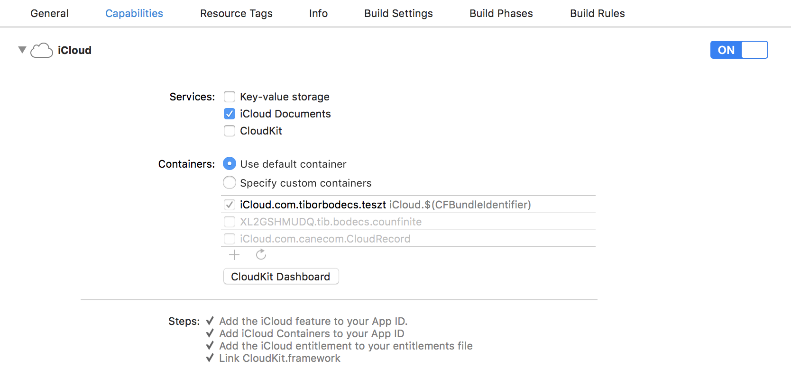

## iCloud drive project setup tutorial

Let's start by creating a new project for iOS. You can select the single view application template, don't worry too much about document based apps, because in this tutorial we're not going to touch the `UIDocument` class at all. 🤷‍♂️




The first step is to enable iCloud capabilities, which will generate a new entitlements file for you. Also you'll have to enable the iCloud application service for the app id on the [Apple developer](https://developer.apple.com/account/ios/identifier/bundle) portal. You should also assign the iCloud container that's going to be used to store data. Just a few clicks, but you have to do this manually. 💩

> NOTE: You need a valid Apple Developer Program membership in order to set [advanced app capabilities](https://developer.apple.com/support/app-capabilities/) like iCloud support. So you have to pay $99/year. #greed 🤑


So I believe that now you have a proper iOS app identifier with iCloud capabilities and application services enabled. One last step is ahead, you have to add these few lines to your `Info.plist` file in order to define the [iCloud drive](https://medium.com/ios-os-x-development/icloud-drive-documents-1a46b5706fe1) container (folder name) that you're going to use. Note that you can have multiple containers for one app.

```xml
<key>NSUbiquitousContainers</key>
<dict>
    <key>iCloud.com.tiborbodecs.teszt</key>
    <dict>
        <key>NSUbiquitousContainerIsDocumentScopePublic</key>
        <true/>
        <key>NSUbiquitousContainerName</key>
        <string>Teszt</string>
        <key>NSUbiquitousContainerSupportedFolderLevels</key>
        <string>Any</string>
    </dict>
</dict>
```

Finally we're ready to move forward with some actual coding. 💻

## Files inside iCloud drive containers

Working with iCloud files using Swift is relatively easy. Basically you just have to get the base URL of your iCloud drive container, and you can do whatever you want. 🤔 However I'll show you some best practices & tricks.

First you have to check if your container folder already exists, if not you should create it by hand using the FileManager class. I've also made a "shortcut" variable for the container base URL, so I don't have to write all those long words again. 😅

```swift
var containerUrl: URL? {
    FileManager.default.url(
        forUbiquityContainerIdentifier: nil
    )?.appendingPathComponent("Documents")
}
// check for container existence
if 
    let url = self.containerUrl, 
    !FileManager.default.fileExists(
        atPath: url.path, 
        isDirectory: nil
    ) {
    do {
        try FileManager.default.createDirectory(
            at: url, withIntermediateDirectories: true, 
            attributes: nil
        )
    }
    catch {
        print(error.localizedDescription)
    }
}
```

Working with paths inside the iCloud drive container is simple, you can append path components to the base URL and use that exact location URL as you want.

```swift
let myDocumentUrl = self.containerUrl?
    .appendingPathComponent(subDirectory)
    .appendingPathComponent(fileName)
    .appendingPathExtension(fileExtension)
```

Picking existing files is also quite straightforward. You can use the built-in document picker class from UIKit. There are only two catches here. 🤦‍♂️

First one is that you need to provide the type of the documents that you'd like to access. Have you ever heard about [UTI](https://developer.apple.com/library/content/documentation/FileManagement/Conceptual/understanding_utis/understand_utis_intro/understand_utis_intro.html#//apple_ref/doc/uid/TP40001319-CH201-SW1)'s? No? Maybe yes...? The thing is that you have to find the proper [uniform type identifier](https://developer.apple.com/library/content/documentation/FileManagement/Conceptual/understanding_utis/understand_utis_declare/understand_utis_declare.html#//apple_ref/doc/uid/TP40001319-CH204-SW1) for every file type, instead of providing an extension or mime-type or something commonly used thing. Smart one, huh? 🧠

```swift
let picker = UIDocumentPickerViewController(
    documentTypes: ["public.json"], 
    in: .open
)
picker.delegate = self
picker.modalPresentationStyle = .fullScreen
self.present(picker, animated: true, completion: nil)
```

The second catch is that you have to "unlock" the picked file before you start reading it. That can be done by calling the `startAccessingSecurityScopedResource` method. Don't forget to call the stopAccessingSecurityScopedResource method, or things are going to be out of balance. You don't want that, trust me! #snap 🧤

```swift
func documentPicker(
    _ controller: UIDocumentPickerViewController, 
    didPickDocumentsAt urls: [URL]
) {
    guard
        controller.documentPickerMode == .open,
        let url = urls.first,
        url.startAccessingSecurityScopedResource()
    else {
        return
    }
    defer {
        url.stopAccessingSecurityScopedResource()
    }
    // do some work with the url
}
```

Everything else works as you'd expect. You can save files directly into the container through file APIs or by using the `UIDocumentPickerViewController` instance. Here are some of the most common api calls, that you can use to manipulate files.

```swift
// string
try string.write(to: url, atomically: true, encoding: .utf8)
try String(contentsOf: url)

// data
try data.write(to: url, options: [.atomic])
try Data(contentsOf: url)

// file manager
FileManager.default.copyItem(at: local, to: url)
FileManager.default.removeItem(at: url)
```

You can read and write any kind of string, data. By using the `FileManager` you can copy, move, delete items or change file attributes. All your documents stored inside iCloud drive will be magically available on every device. Obviously you have to be logged in with your iCloud account, and have enough free storage. 💰

## Debugging

If you alter something in your settings you might want to increment your build number as well in order to notify the operating system about the changes. 💡

On the mac all the iCloud drive files / containers are located under the user's Library folder inside the Mobile Documents directory. You can simply use the Terminal or Finder to go there and list all the files. Pro tip: look for hidden ones as well! 😉

```sh
cd ~/Library/Mobile\ Documents
ls -la
# ls -la|grep tiborbodecs
```
You can also monitor the activity of the CloudDocs daemon, by using this command:

```sh
# man brctl
brctl log --wait --shorten
```

The output will tell you what's actually happening during the sync.


I encourage you to check the manual entry for the `brctl` command, because there are a few more flags that can make troubleshooting more easy. 🤐

This article was heavily inspired by [Marcin Krzyzanowski](https://x.com/krzyzanowskim)'s really old blog post. 🍺

