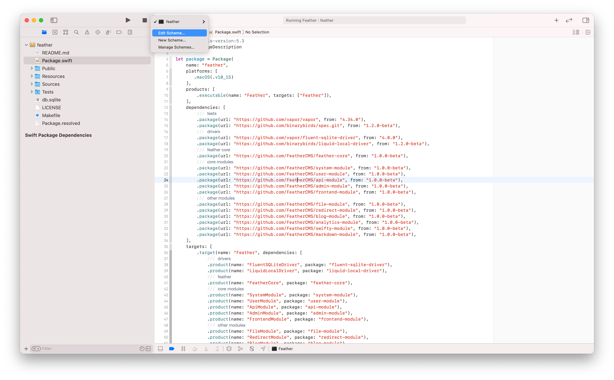

## What is a custom working directory?

When you try to build and run your Vapor application using Xcode you might face the issue that there are some missing files, resources or Leaf templates. Don't worry this is a very common rookie mistake, but what causes this problem exactly? 🤔

Vapor is using a place called working directory to set the current environment, locate common resources and publicly available files. This working directory usually contains a Resources folder where you can put your Leaf templates and a Public folder which is used by the [FileMiddleware](https://docs.vapor.codes/4.0/middleware/#file-middleware). The server is also trying to search for possible [dotenv](https://docs.vapor.codes/4.0/environment/) files to configure environmental variables.

If you run your backend application without explicitly setting a custom working directory, you should see a warning message in Xcode's console. If you are using [Feather CMS](https://github.com/feathercms/feather/), the app will crash without a custom working directory set, because it is required to provide a working environment. 🙃

 
If you don't specify this custom work dir, Xcode will try to look for the resources under a random, but uniquely created place somewhere under the `DerivedData` directory.

This is the internal build folder for the IDE, it usually creates lots of other "garbage" files into the `~/Library/Developer/Xcode/DerivedData` directory. In 99% of the cases you can safely delete its contents if you want to perform a 100% clean build. 👍

## How to set a custom working directory?

First of all, open your project in Xcode by double clicking the Package.swift manifest file.

> WARN: Do NOT use the `swift package generate-xcodeproj` command to generate a project file!!! This is a deprecated Swift Package Manager command, and it's going to be removed soon.

✅ I repeat: always open SPM projects through the `Package.swift` file.

 
Wait until the IDE loads the required Swift packages. After the dependencies are loaded, click on the target next to the stop button. The executable target is marked with a little terminal-like icon. 💡

Select the "Edit Scheme..." option from the available menu items, this should open a new modal window on top of Xcode.

 
Make sure that the Run configuration is selected on the left side of the pane. Click on the "Options" tab, and then look for the "Working directory" settings. Check the "Use custom working directory:" toggle, this will enable the input field underneath, then finally click on the little folder icon on the top right side (of the input field) and look for your desired directory using the interface. 🔍

Press the "Choose" button when you are ready. You should see the path of your choice written inside the text field. Make sure that you've selected the right location. Now you can click the "Close" button on the bottom right corner, then you can try to start your server by clicking the run button (play icon or you can press the CMD+R shortcut to run the app). ▶️

If you did everything right, your Vapor server application should use the custom working directory, you can confirm this by checking the logs in Xcode. The previously mentioned warning should disappear and your backend should be able to load all the necessary resources without further issues. I hope this little guide will help you to avoid this common mistake when using Vapor. 🙏
