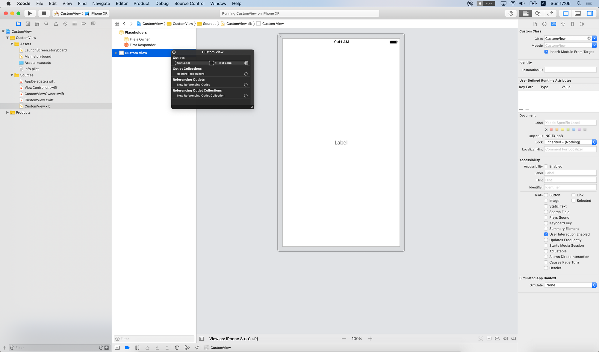
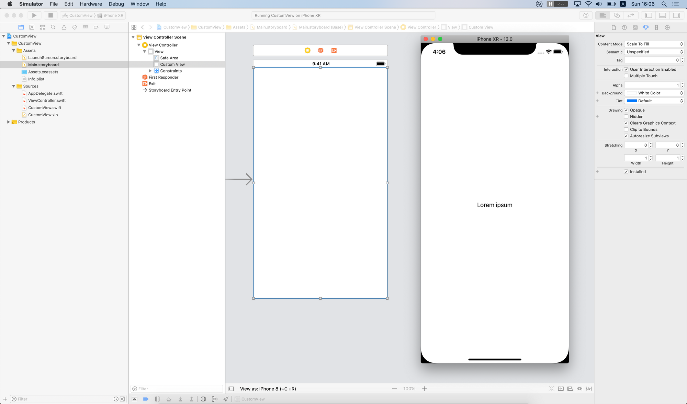

I already have a comprehensive guide about [initializing views and controllers](https://theswiftdev.com/uikit-init-patterns/), but that one lacks a very special case: creating a custom view using interface builder. 🤷‍♂️

## Loading xib files

Using the contents of a [xib](http://eppz.eu/blog/uiview-from-xib/) file is a pretty damn easy task to do. You can use the following two methods to load the contents (aka. the view hierarchy) of the file.

```swift
let view = UINib(
    nibName: "CustomView", 
    bundle: .main
).instantiate(
    withOwner: nil, 
    options: nil
).first as! UIView

// does the same as above
// let view = Bundle.main.loadNibNamed(
//    "CustomView", 
//    owner: nil, 
//    options: nil
// )!.first as! UIView 

view.frame = self.view.bounds
self.view.addSubview(view)
```

The snippet above will simply instantiate a view object from the [xib file](https://medium.com/@brianclouser/swift-3-creating-a-custom-view-from-a-xib-ecdfe5b3a960). You can have multiple root objects in the view hierarchy, but this time let's just pick the first one and use that. I assume that in 99% of the cases this is what you'll need in order to get your custom designed views. Also you can extend the UIView object with any of the solutions above to create a [generic](https://theiconic.tech/instantiating-from-xib-using-swift-generics-632a2b3d8109) view loader. More on that later... 😊

This method is pretty simple and cheap, however there is one little drawback. You can't get named pointers (outlets) for the views, but only for the root object. If you are putting design elements into your screen, that's fine, but if you need to display dynamic data, you might want to reach out for the underlying views as well. 😃

## Custom views with outlets & actions

So the proper way to load custom views from xib files goes something like this:

Inside your custom view object, you instantiate the xib file exactly the same way as I told you right up here. 👆 The only difference is that you don't need to use the object array returned by the methods, but you have to connect your view objects through the interface builder, using the File's Owner as a reference point, plus a custom container view outlet, that'll contain everything you need. 🤨

```swift
// note: view object is from my previous tutorial, with autoresizing masks disabled
class CustomView: View {

    // this is going to be our container object
    @IBOutlet weak var containerView: UIView!

    // other usual outlets
    @IBOutlet weak var textLabel: UILabel!

    override func initialize() {
        super.initialize()

        // first: load the view hierarchy to get proper outlets
        let name = String(describing: type(of: self))
        let nib = UINib(nibName: name, bundle: .main)
        nib.instantiate(withOwner: self, options: nil)

        // next: append the container to our view
        self.addSubview(self.containerView)
        self.containerView.translatesAutoresizingMaskIntoConstraints = false
        NSLayoutConstraint.activate([
            self.containerView.topAnchor.constraint(equalTo: self.topAnchor),
            self.containerView.bottomAnchor.constraint(equalTo: self.bottomAnchor),
            self.containerView.leadingAnchor.constraint(equalTo: self.leadingAnchor),
            self.containerView.trailingAnchor.constraint(equalTo: self.trailingAnchor),
        ])
    }
}
```
So the initialize method here is just loading the nib file with the owner of self. After the loading process finished, your outlet pointers are going to be filled with proper values from the xib file. There is one last thing that we need to do. Even the views from the xib file are "programmatically" connected to our [custom view](https://medium.com/swift2go/swift-custom-uiview-with-xib-file-211bb8bbd6eb) object, but visually they aren't. So we have to add our container view into the view hierarchy. 🤐



If you want to use your custom view object, you just have to create a new instance from it - inside a view controller - and finally feel free to add it as a subview!

One word about bounds, frames aka. springs and struts: fucking UGLY! That's two words. They are considered as a bad practice, so please use [auto layout](https://theswiftdev.com/2017/10/31/ios-auto-layout-tutorial-programmatically/), I have a nice [tutorial about anchors](https://theswiftdev.com/2018/06/14/mastering-ios-auto-layout-anchors-programmatically-from-swift/), they are amazing and learning them takes about 15 minutes. 😅

```swift
class ViewController: UIViewController {

    weak var customView: CustomView!

    override func loadView() {
        super.loadView()

        let customView = CustomView()
        self.view.addSubview(customView)
        NSLayoutConstraint.activate([
            customView.topAnchor.constraint(equalTo: self.view.topAnchor),
            customView.bottomAnchor.constraint(equalTo: self.view.bottomAnchor),
            customView.leadingAnchor.constraint(equalTo: self.view.leadingAnchor),
            customView.trailingAnchor.constraint(equalTo: self.view.trailingAnchor),
        ])
        self.customView = customView
    }

    override func viewDidLoad() {
        super.viewDidLoad()

        self.customView.textLabel.text = "Lorem ipsum"
    }
}
```

That's it, now you have a completely working custom UIView object that loads a xib file in order to use it's contents. Wasn't so bad, right? 🤪

One more extra thing. If you don't like to handle views programmatically or you simply don't want to mess around with the `loadView` method, just remove it entirely. Next put the `@IBOutlet` keyword right before your custom view class variable. Open your storyboard using IB, then drag & drop a new UIView element to your controller and connect the custom view outlet. It should work like magic. 💫



I promised outlets and actions in the heading of this section, so let's talk a little bit about IBActions. They work exactly the same as you'd expect them with controllers. You can simply hook-up a button to your custom view and delegate the action to the custom view class. If you want to forward touches or specific actions to a controller, you should use the [delegate pattern](https://theswiftdev.com/2018/06/27/swift-delegate-design-pattern/) or go with a simple block. 😎

## Ownership and container views

It is possible to leave out all the xib loading mechanism from the view instance. We can create a set of extensions in order to have a nice view loader with a custom view class from a xib file. This way you don't need a container view anymore, also the owner of the file can be left out from the game, it's more or less the same method as reusable cells for tables and collections created by Apple. 🍎

You should know that going this way you can't use your default UIView init methods programmatically anymore, because the xib file will take care of the init process. Also if you are trying to use this kind of custom views from a storyboard or xib file, you won't be able to use your outlets, because the correspondig xib of the view class won't be loaded. Otherwise if you are trying to load it manyally you'll run into an infinite loop and eventually your app will crash like hell. 😈

```swift
import UIKit

extension UINib {
    func instantiate() -> Any? {
        return self.instantiate(withOwner: nil, options: nil).first
    }
}

extension UIView {

    static var nib: UINib {
        return UINib(nibName: String(describing: self), bundle: nil)
    }

    static func instantiate(autolayout: Bool = true) -> Self {
        // generic helper function
        func instantiateUsingNib<T: UIView>(autolayout: Bool) -> T {
            let view = self.nib.instantiate() as! T
            view.translatesAutoresizingMaskIntoConstraints = !autolayout
            return view
        }
        return instantiateUsingNib(autolayout: autolayout)
    }
}

class CustomView: UIView {

    @IBOutlet weak var textLabel: UILabel!
}

// usage (inside a view controller for example)
// let view = CustomView.instantiate()
```

Just like with table or collection view cells this time you have to set your custom view class on the view object, instead of the File's Owner. You have to connect your outlets and basically you're done with everything. 🤞


From now on you should ALWAYS use the instantiate method on your custom view object. The good news is that the function is generic, returns the proper instance type and it's highly reusable. Oh, btw. I already mentioned the bad news... 🤪

There is also one more technique by overriding [awakeAfter](https://stackoverflow.com/questions/9282365/load-view-from-an-external-xib-file-in-storyboard/40343124#40343124), but I would not rely on that solution anymore. In most of the cases you can simply set the File's Owner to your custom view, and go with a container, that's a safe bet. If you have special needs you might need the second approach, but please be careful with that. 😉
